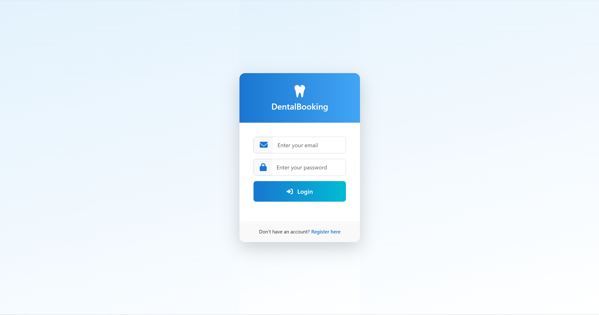
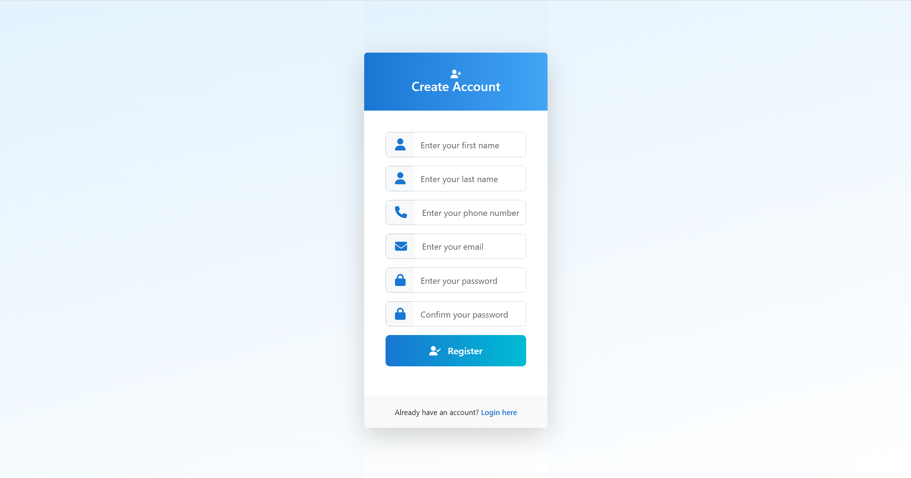
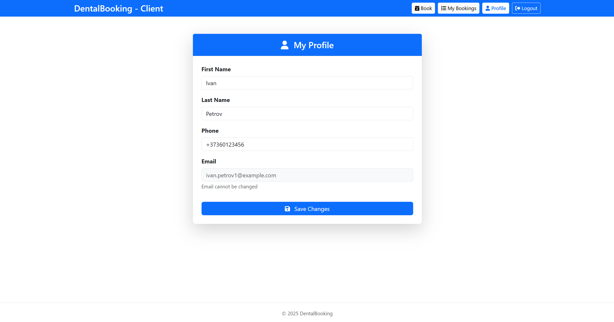
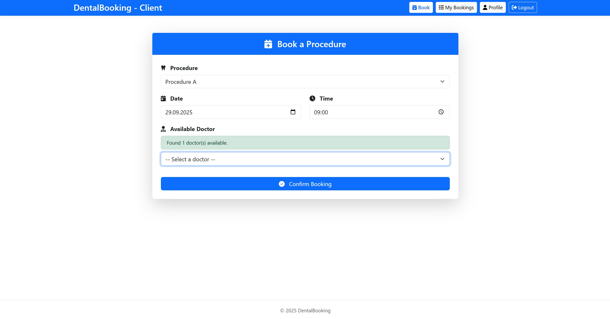
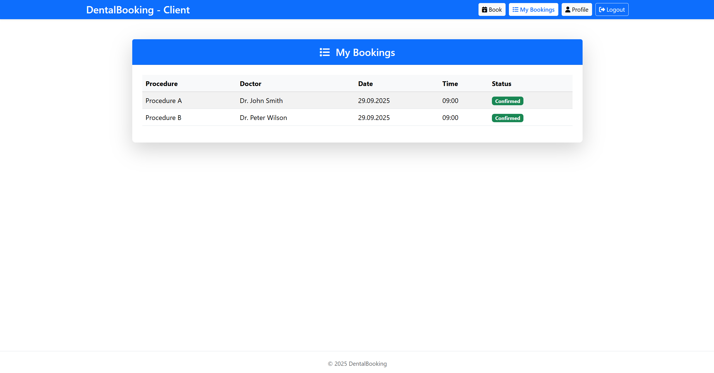
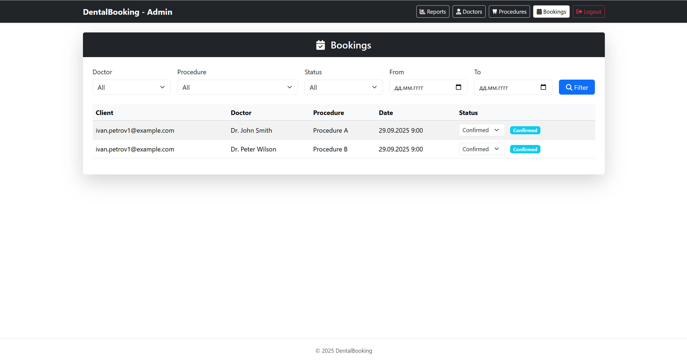
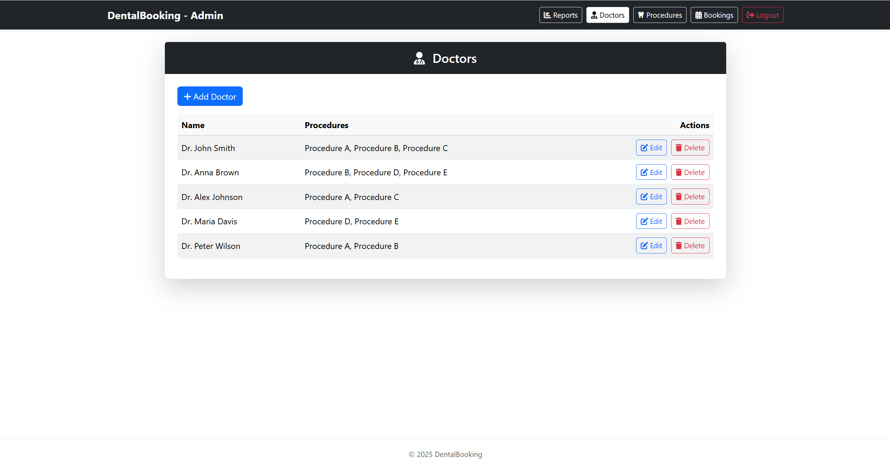
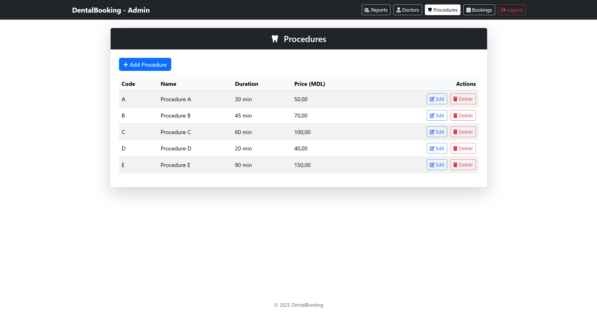
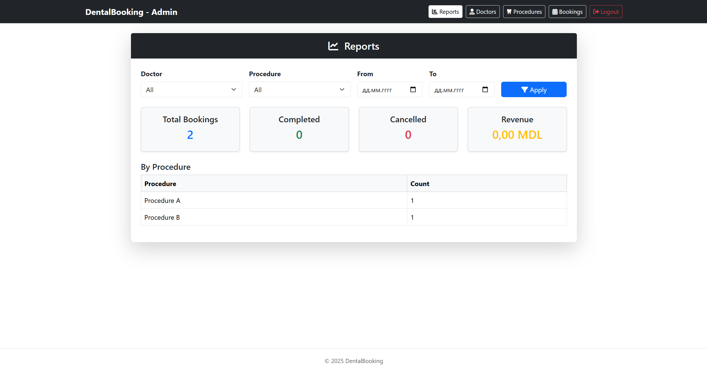

# 🦷 DentalBooking

DentalBooking is an **ASP.NET Core web application** for managing bookings in a dental clinic.  
It demonstrates clean layered architecture, **CQRS**, and **MediatR** with role-based authentication.

_(This project was developed as a test assignment.)_

---

## 📋 Project Description

The application allows clients to register, confirm their email, and book dental procedures with available doctors.  
Administrators can manage doctors, procedures, and view statistics.

- **5 doctors** are predefined.  
- **5 procedures**: A, B, C, D, E.  
- A doctor can perform several procedures (maximum 3).  

### Features

- Client registration with **email confirmation**  
- Login and booking:
  - choose a procedure  
  - select date and time  
  - get a list of available doctors  
- Admin area:
  - manage doctors and procedures  
  - view all bookings with search and sorting  
  - view **statistics reports** (doctor, procedure, date range)  
- Notifications:
  - registration confirmation  
  - booking confirmation  
  - reminder 1 day before the procedure  
  - cancellation notice  
- Roles & permissions:  
  - `Client`  
  - `Admin`

---

## ⚙️ Technologies

- **ASP.NET Core 9** (Razor Pages, Identity)  
- **Entity Framework Core** (Code First + SQLite)  
- **CQRS + MediatR**  
- **FluentValidation**  
- **Dependency Injection**  
- **Background Services** (email reminders)  
- **Bootstrap 5** + **FontAwesome**  
- **Layered Architecture**  
  - `DentalBooking.Domain`  
  - `DentalBooking.Application`  
  - `DentalBooking.Infrastructure`  
  - `DentalBooking.Web`

---

## 🚀 How to Run

1. Clone the repository:
   ```bash
   git clone https://github.com/yourusername/DentalBooking.git
   cd DentalBooking
   ```

2. Open the solution in **Visual Studio** or **VS Code**.  

3. Ensure you have:
   - **.NET SDK 9.0+**  
   - **SQLite**

4. Apply migrations and create the database:
   ```bash
   dotnet ef database update --project DentalBooking.Infrastructure --startup-project DentalBooking.Web
   ```

5. Run the application:
   ```bash
   dotnet run --project DentalBooking.Web
   ```

6. Open in browser:
   ```
   http://localhost:5184
   ```

### 🔑 Default Accounts

**Admin**  
- Email: `admin@dental.com`  
- Password: `Admin123!`  

**Clients**  
- `client1@dental.com / Client123!`  
- `client2@dental.com / Client123!`

---

## ✅ Achievements

- Authentication and role-based authorization  
- Email confirmation flow (console email sender for demo)  
- Admin panel:
  - manage doctors  
  - manage procedures  
  - manage bookings  
- Client panel:
  - profile page  
  - create booking  
  - my bookings  
- Background service for sending email reminders  
- Statistics dashboard with filtering  
- Clean layered architecture with CQRS and MediatR  

---

## 🔮 Potential Future Improvements

- Replace console email sender with a real SMTP provider (e.g., SendGrid, Gmail)  
- Add unit and integration tests  
- Expose REST API for mobile/SPA integration  
- Enhance UI/UX with a modern responsive design  
- Implement doctor availability calendar with time slots  
- Containerize with Docker  
- Deploy to Azure / AWS with CI/CD pipeline  

---

## 📸 Screenshots

### Client Area

#### Login


#### Register


#### Profile


#### Booking


#### My Bookings


---

### Admin Area

#### Bookings


#### Doctors


#### Procedures


#### Reports

